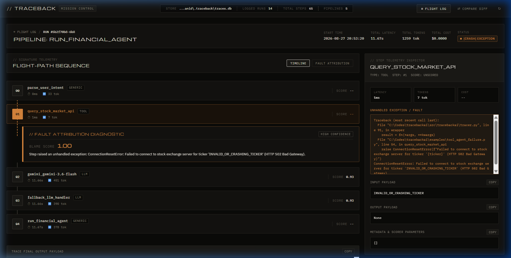

# Traceback AI (`agent-blame`)

[](https://pypi.org/project/agent-blame/)
[](https://pypi.org/project/agent-blame/)
[](https://github.com/Sanidhyavijay24/Traceback-ai/actions/workflows/ci.yml)
[](benchmarks/blame_accuracy.py)
[](LICENSE)

> **LLM Agent Execution Tracer with Failure Attribution** — *strace for LLM pipelines.*

> [!NOTE]
> **Package Identity:** Available on PyPI as [`agent-blame`](https://pypi.org/project/agent-blame/) (`pip install agent-blame`). Inside your Python code, import as `import tracebackai`. Command-line interface is available via `traceback` or shorthand `tb`.

Your LLM agent failed. The final answer was hallucinated, truncated, or incomplete, but your pipeline ran five tool calls, two retrieval steps, and three prompt transforms. Which step actually caused the failure?

`agent-blame` instruments any LLM or agent pipeline, records execution spans in local SQLite storage, evaluates step-level health metrics, and deterministically attributes root-cause failures to the exact offending step.

---

## 🎛️ Mission Control Web Dashboard

Launch the local interactive Mission Control dashboard to inspect execution timelines, step health scores, failure attribution diagnostics, and cross-run diff comparisons:

```bash
traceback serve
# or shorthand:
tb serve
```



---

## 📦 Installation

```bash
pip install agent-blame

# Optional extras:
pip install "agent-blame[semantic]"    # Sentence-transformers semantic embeddings
pip install "agent-blame[gemini]"      # Google Gemini SDK instrumentation
pip install "agent-blame[anthropic]"   # Anthropic SDK instrumentation
pip install "agent-blame[openai]"      # OpenAI SDK instrumentation
pip install "agent-blame[langchain]"   # LangChain callbacks
pip install "agent-blame[all]"         # All integrations & extras
```

---

## ⚡ Quickstart

Instrument your functions with `@trace`. Decorate your pipeline entrypoint with `@trace(pipeline=True)`:

```python
from tracebackai import trace

@trace(step_type="retrieval")
def retrieve_docs(query: str) -> list[str]:
    # Returns relevant passages from your database or index
    return ["Retrieval-augmented generation combines search with LLMs."]

@trace(step_type="prompt")
def build_prompt(query: str, docs: list[str]) -> str:
    return f"Context:\n{chr(10).join(docs)}\n\nQuestion: {query}"

@trace(step_type="llm")
def generate_answer(prompt: str) -> str:
    # Call Claude, Gemini, GPT-4, or any custom model
    return "RAG combines search retrieval with generative language models."

@trace(pipeline=True)
def answer_pipeline(query: str) -> str:
    docs = retrieve_docs(query)
    prompt = build_prompt(query, docs)
    return generate_answer(prompt)

if __name__ == "__main__":
    answer_pipeline("What is RAG?")
```

---

## 🖥️ CLI Inspection & Failure Attribution

Every execution is persisted to `~/.traceback/traces.db` (configurable via `TRACEBACK_DB_PATH`).

### 1. Inspect Execution Spans (`traceback show` / `tb show`)

```bash
$ tb show abc123def

Run: abc123def  |  Pipeline: answer_pipeline  |  2026-08-25 14:32:01
──────────────────────────────────────────────────────────────────────
[0] retrieve_docs      retrieval    12ms   tokens=48  score=0.91 [OK]
    input:  What is RAG?
    output: ["Retrieval-augmented generation combines search with LLMs."]
[1] build_prompt       prompt        1ms   tokens=82
    input:  What is RAG?
    output: Context: Retrieval-augmented generation...
[2] generate_answer    llm         840ms   tokens=120 score=0.93 [OK]
    input:  Context: Retrieval-augmented generation...
    output: RAG combines search retrieval with generative language models.
──────────────────────────────────────────────────────────────────────
Total: 853ms  |  Final Output: RAG combines search retrieval with...
```

### 2. Attribute Failure to Root Cause (`traceback blame` / `tb blame`)

```bash
$ tb blame bad456xyz

Analyzing run bad456xyz (rag_pipeline, 4 steps)...

[BLAME] Step [0] retrieve_docs  (retrieval)
   Score:       0.00  (threshold: 0.33)
   Blame score: 1.82  (high confidence)
   Reason:      Retrieved passages had low query similarity (0.00 < 0.33). Downstream steps were starved of relevant context.

Co-blame: none
Other steps: build_prompt (unscored), generate_answer (0.93 [OK])
```

### 3. Compare Two Runs (`traceback diff` / `tb diff`)

```bash
$ tb diff abc123def bad456xyz

Comparing abc123def -> bad456xyz
Pipeline: answer_pipeline

STEP                 SCORE_A    SCORE_B    DELTA      STATUS
─────────────────────────────────────────────────────────────────
generate_answer      0.93       0.50       -0.43      [-] REGRESSED <-- highest delta
retrieve_docs        0.91       0.91       +0.00      -> stable
build_prompt         N/A        N/A        +0.00      -> stable

Verdict: REGRESSION in generate_answer
Details: Significant quality regression in 'generate_answer' (delta: -0.43).
```

---

## 🔬 How Scoring Works

Before traces are written to SQLite, each step is evaluated by registered step scorers:

- **Retrieval Scorer (`step_type="retrieval"`)**: Measures semantic cosine similarity between the query input and retrieved chunks using `sentence-transformers` (`all-MiniLM-L6-v2`), clamped to `[0.0, 1.0]`. Automatically falls back to pure-Python BM25 term overlap if dependencies are absent. Uses method-aware thresholding (flags weak retrieval when score $< 0.55$ for semantic embeddings, or $< 0.33$ for BM25 term overlap).
- **LLM Scorer (`step_type="llm"`)**: Evaluates a composite of **response completeness** (scaled against an absolute floor of `20` tokens so concise correct answers to large RAG prompts are never penalized), **refusal detection** (detects refusal strings like `"I cannot"`, `"As an AI"` and zeroes the score), and **self-consistency** (pairwise ROUGE-L across multi-sample completions).
- **Tool Scorer (`step_type="tool"`)**: Evaluates exceptions, validates non-empty payloads, validates against optional `expected_type` metadata, and dynamically penalizes based on historical failure rates in SQLite.

---

## 🎯 How Blame Attribution Works

`traceback blame` ranks candidate failure steps deterministically without expensive or recursive LLM calls:

$$\text{blame\_score}(\text{step}) = \text{deficiency} \times \text{weight}(\text{step\_type}) \times \text{recency\_weight}(\text{index}, \text{total})$$

- **Type Weights**: `retrieval: 1.4` (retrieval failures compound downstream), `llm: 1.2`, `tool: 1.1`, `prompt: 0.9`, `generic: 0.8`.
- **Recency Multiplier**: $1.0 + 0.3 \times \left(1.0 - \frac{\text{index}}{\text{total}}\right)$, giving higher impact to upstream steps.
- **Quality-Threshold Awareness**: Steps exceeding their health threshold have attenuated residual deficiency, ensuring healthy traces stay at near-zero blame score ($< 0.10$).
- **Unscored Step Safety**: Generic steps (`score is None`) are excluded from blame candidacy so they never corrupt attribution. If all steps are unscored, blame identifies the slowest execution bottleneck.

### 📊 Benchmark Accuracy

`agent-blame` is continuously evaluated across 19 realistic failure and healthy scenarios spanning retrieval, LLM, tool, conversational BM25, and cascading degradations ([`benchmarks/blame_accuracy.py`](benchmarks/blame_accuracy.py)):

- **Top-1 Attribution Accuracy**: **100.0%** (14/14 failure scenarios correctly attributed)
- **False-Positive Rate**: **0/4 (0.0%)** on healthy traces (blame score remains $< 0.10$)
- **Benchmark Runtime**: **< 0.2s** (100% offline, zero network access, zero external API keys)

| Category | Correct | Total | Accuracy |
|----------|---------|-------|----------|
| `retrieval` | 3 | 3 | **100.0%** |
| `llm` | 4 | 4 | **100.0%** |
| `tool` | 3 | 3 | **100.0%** |
| `cascading` | 2 | 2 | **100.0%** |
| `fallback` | 2 | 2 | **100.0%** |

---

## 🚀 CI Eval Gate Integration

Add automated failure-attribution gates to pull requests in GitHub Actions:

```yaml
name: Eval Gate
on: [pull_request]

jobs:
  eval:
    runs-on: ubuntu-latest
    steps:
      - uses: actions/checkout@v4
      - uses: actions/setup-python@v5
        with: { python-version: "3.11" }
      - run: pip install -e ".[all]"
      - run: traceback run examples/simple_rag.py --input examples/test_cases.json --fail-on-blame 0.7
```

---

## 🔌 SDK Integrations

| Integration | Usage | Traced Metrics |
|-------------|-------|----------------|
| **Google Gemini** | `from tracebackai.integrations.gemini import TracedGemini` | `model`, `input_tokens`, `output_tokens`, `latency_ms` |
| **Anthropic** | `from tracebackai.integrations.anthropic import TracedAnthropic, patch_anthropic` | `model`, `input_tokens`, `output_tokens`, `stop_reason` |
| **OpenAI** | `from tracebackai.integrations.openai import TracedOpenAI, patch_openai` | `model`, `input_tokens`, `output_tokens`, `finish_reason` |
| **LangChain** | `from tracebackai.integrations.langchain import TracebackCallbackHandler` | `on_llm_*`, `on_retriever_*`, `on_tool_*` |

---

## 🗺️ Roadmap & Implemented Features

- [x] Phase 1: Core tracer, SQLite persistence, `@trace`, Click CLI (`list`, `show`)
- [x] Phase 2: Retrieval (cosine/BM25), LLM, and Tool scorers
- [x] Phase 3: Blame attribution algorithm, cross-run diffing, explanation generator
- [x] Phase 4: Gemini / Anthropic / OpenAI / LangChain integrations, CI eval gates, PyPI packaging
- [x] Phase 5: Local Web UI Mission Control dashboard (`traceback serve` / `tb serve`)
- [ ] Upcoming: Async tracer support, OpenTelemetry OTLP export

---

## 📄 License & Contributing

Licensed under the [MIT License](LICENSE). See [CONTRIBUTING.md](CONTRIBUTING.md) for local development guidelines.
